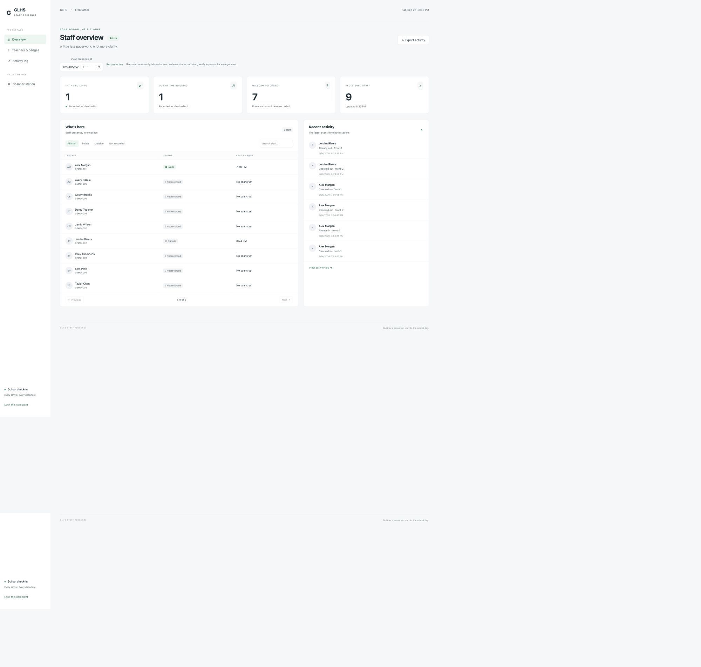

# GLHS Staff Presence


A local school front-office pilot: two barcode scanner stations, printable teacher QR badges, and an office dashboard. Python **FastAPI + SQLAlchemy**, SQLite locally, PostgreSQL/Supabase later. All sample teachers are fictional.



## Backend

The backend owns teacher registration, QR badge lookup, station authentication, arrival/departure transactions, presence history, and CSV exports. Both scanner computers connect to this one API. See the [API reference](docs/API.md) for routes, request examples, and retry behavior.

## Run locally

Install Python 3.11+ and [uv](https://docs.astral.sh/uv/). Then:

```sh
uv sync --extra dev --locked
uv run python -m app.setup keys
uv run --env-file .env python -m app.setup demo
uv run --env-file .env uvicorn app.main:create_app --factory --host 127.0.0.1 --port 8317
```

Open http://127.0.0.1:8317. Open `.env` **locally** to find the generated keys; never commit or share that file. The office dashboard uses `ADMIN_KEY`. Each scanner computer signs in as **Scanner station** with its own `STATION_1_KEY` or `STATION_2_KEY`. Keys remain in the current tab's session storage until you lock it or close the tab. `demo` is optional; omit it when starting an empty roster. The demo badge codes live only in ignored `data/demo-badges.json`.

Teachers & badges → enter name and teacher ID → Add teacher → print the QR badge. The QR contains a random token, not the teacher's name/ID. Only its SHA-256 hash is saved. Replacing a badge revokes the old one; print the replacement immediately.

## Two computers, one source of truth

Run **one server**; both front computers open that same server URL. Do not run a separate SQLite database on each computer. Station 1 defaults to IN; configure station 2 to OUT using its large direction button. Direction is remembered per tab. USB scanners should use **HID Keyboard** mode with an **Enter suffix**. Focus the badge input, scan, and wait for the on-screen confirmation. A scanner's beep only means it read the badge, not that the server saved it.

For a supervised LAN pilot, the server can listen with `--host 0.0.0.0`; both computers use its LAN address and port 8317. Plain HTTP exposes keys/attendance to the network; use a school-approved HTTPS reverse proxy before real teacher data or routine operation. Keep the SQLite file on the server's local disk, not a network share. Supabase will host the database; a Python server is still needed to serve the app and API.

## Behavior

- Explicit IN/OUT avoids accidental toggling. Repeated IN stays IN and is logged as a repeat.
- Server timestamps and an append-only scan history support current and historical presence.
- Dashboard refreshes every five seconds and identifies failed refreshes as potentially stale.
- Network retries keep the original request ID; an already saved scan is not saved twice. An ambiguous failed scan blocks new scans until retried.
- Both stations serialize updates to the same teacher: SQLite uses `BEGIN IMMEDIATE`; PostgreSQL locks the teacher row.
- Office corrections require a reason and enter the audit history. No automatic midnight checkout: overnight presence stays recorded until corrected or scanned out.
- Deactivation requires an OUT state and disables the badge. Historical snapshots include teachers registered at that time, even if now inactive; current names and teacher IDs are used.
- History displays the latest 200 events; CSV exports all history with UTC timestamps and spreadsheet formula protection.
- Presence means **recorded status**, not guaranteed physical presence. No-scan staff appear outside; a missed departure can leave someone inside.

## Verify

```sh
uv run --extra dev pytest -q
node --check app/static/app.js
```

See [implementation plan](docs/PLAN.md), [Supabase setup](docs/SUPABASE.md), and [review packet](docs/REVIEW-PACKET.md). This is a local pilot, not a deployed school system. Hardware scan/print testing and school approval remain before use with real staff.
